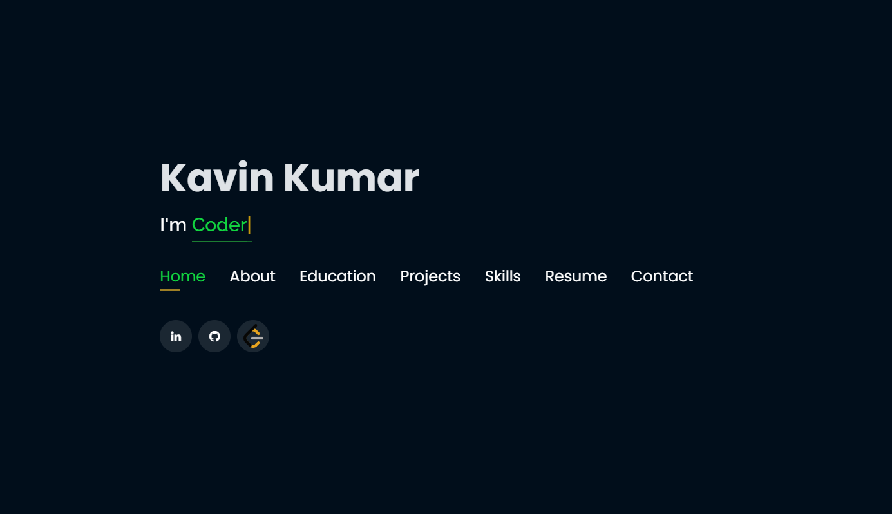
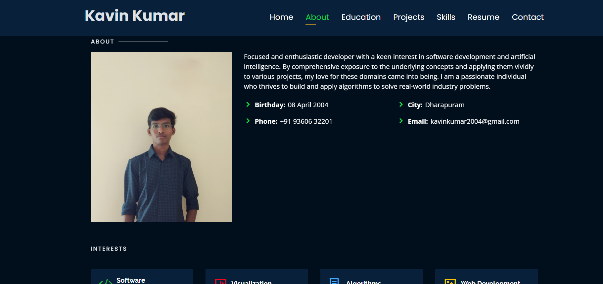
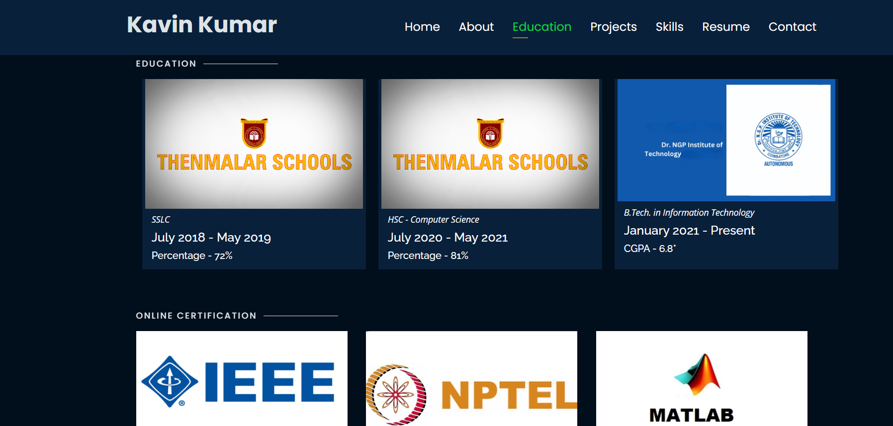
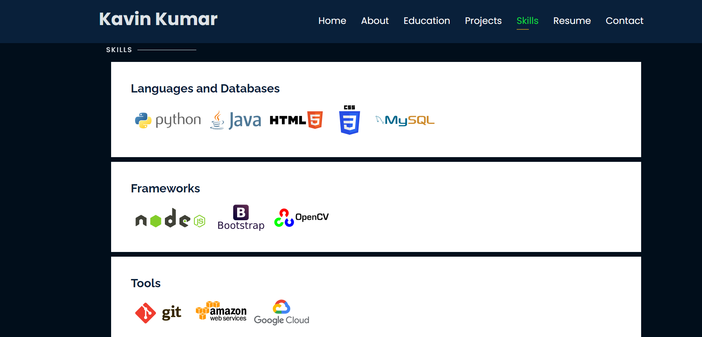
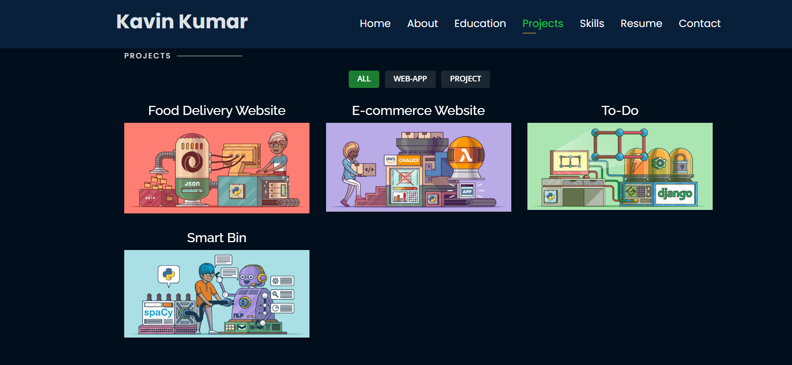
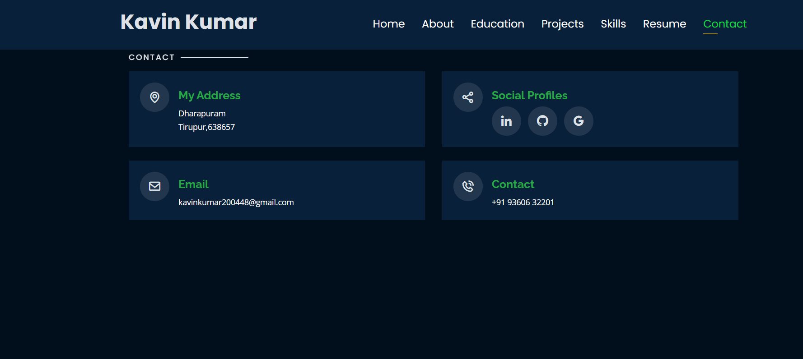

# Portfolio

Welcome to my portfolio repository! This repository hosts the code for my personal portfolio website.

Check out the live demo: [Portfolio Demo](https://kavins-portfolio.netlify.app/)

## Screenshots

Include some screenshots or GIFs of your portfolio here.

## Overview

This portfolio showcases my skills and experience in web development. It consists of the following sections:

### Home Page

- [x] Introduction and brief overview.
- [x] Featured projects or recent works.
- [x] Call-to-action buttons or links.



### About Page

- [x] Detailed information about myself.
- [x] My interests and hobbies.
- [x] Personal achievements or experiences.



### Education

- [x] List of educational qualifications.
- [x] Courses or certifications completed.
- [x] Academic achievements.



### Skills

- [x] List of technical skills.
- [x] Proficiency levels (e.g., beginner, intermediate, advanced).
- [x] Skills relevant to the job market.



### Resume

- [x] Downloadable link to my resume in PDF format.
- [x] Summary of work experience.
- [x] Career objectives or goals.



### Contact

- [x] Contact form or email address for inquiries.
- [x] Social media links (LinkedIn, GitHub, etc.).
- [x] Location or availability details.



## Technologies Used

- HTML5
- CSS3 (with SCSS)
- JavaScript
- Bootstrap (or any other frameworks/libraries used)

## How to Use

1. Clone this repository.
   ```bash
   git clone https://github.com/Kavinkumar84/Portfolio.git
